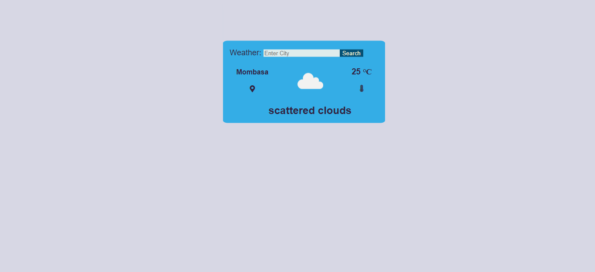

# Weather App

> A simple Javascript Weather app that fetches weather information through an API based on location information entered through the input form or automatically by default by detect current location. 

## Built With

- JavaScript
- HTML
- CSS

## Libraries and packages

- NPM
- Fontawesome

## [Live demo](https://rawcdn.githack.com/paulo-techie/weather-app/1f978dea9e23d9fb1cf010128a90ac87009f06c2/dist/index.html)

### how to run locally

- Download and install [Node.js](https://nodejs.org/en/download/)
- Clone this repository on your terminal by running `git clone https://github.com/paulo-techie/weather-app.git`
- Change your current working directory to the project directory `cd weather-app`
- Run `npm install`
- Run `npm run build`
- Enjoy

## Contributor

👤 Paul Omondi

- Github: [@paulo-techie](https://github.com/paulo-techie)

## 🤝 Contributing

Contributions, issues and feature requests are welcome!

Feel free to check the [issues page](../../issues/).

## Show your support

Give a ⭐️ if you like this project!

## Acknowledgments

- Hat tip to anyone whose code was used
- Inspiration
- etc

## 📝 License

This project is  [MIT](./MIT.md) licensed.
